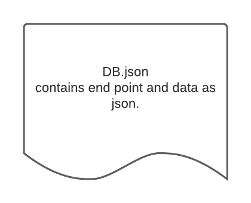

# LAB - Class 06

## Project: Api server

### Author: Waleed Farraj
version 0.99 open Alpha .
### Links and Resources

n/a

### Setup

* json-server required

#### How to initialize/run your application :
* json-server --watch ./data/db.json 

#### Tests

No tests yet

#### UML

---
### swagger hub-link

[swagger](https://app.swaggerhub.com/apis/waleedfarraj/api-server/0.1)

