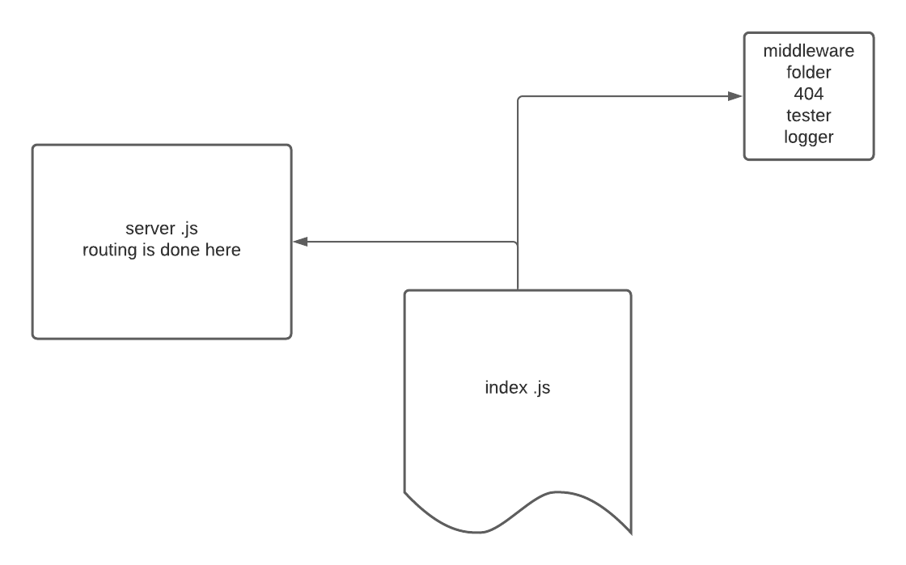

# LAB - Class 06

## Project: Api server

### Author: Waleed Farraj
<!-- version 0.99 open Alpha . -->
<!-- version 2 routes and middleware added .  -->
version 3 routes are modulurized and the api  is connected to a local mongo db.
### Links and Resources

n/a

### Setup

* json-server required
* npm install jest --save-dev
* npm install eslint --save-dev
* npm i dotenv 
* npm i express
* npm i body-parser
* npm i supertest
* npm i mongoose
* npm i cors
* npm i morgan
* npm i @code-fellows/supergoose
#### How to initialize/run your application :
* json-server --watch ./data/db.json .(Outdated after patch 2.)
#####  patch 2 
* node index.js
Then you can use swagger inspector to test  base url is http://localhost:port/api/v1/ .

#### Tests

npm test

#### UML

<!--  -->
<!--  -->

---
### swagger hub-link

[swagger](https://app.swaggerhub.com/apis/waleedfarraj/api-server-3/0.1#/default/post_api_v1_products)

